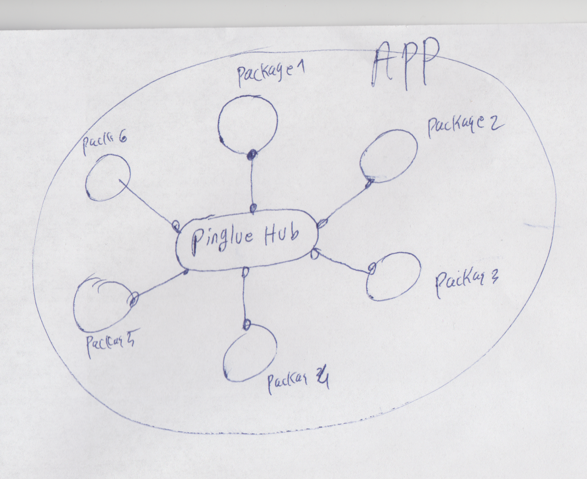

Controller overview
---------------------
Controllers are building blocks in Pinglue apps. In fact, you can imagine a Pinglue app as a collection of controllers that are all connected to a single component called *hub*. 



Hub allows controllers to communicate with eah other. More details about hub will be discussed later.

A controller is simply an instance of a class called *Controller* which is defined in the pinglue package. 

For practical purposes the controllers are actually instance of subclasses of the Controller class so that we can add more functions to them. A minimal template for a custom controller class looks like this:

```typescript
import {Controller} from "pinglue";

export default class extends Controller {

    /**
     * Life cycle method: is called during the init phase
     */
    async init() {

    }

    /**
     * Life cycle method: is called during the start phase
     */
    async start() {

    }
    
}
```

Before using the above code to create some controllers, we need to learn what type of javascript packages can host controllers codes.

Plugin overview
----------------------

The controllers have to be defined in npm packages of course. Roughly speaking, a *Pinglue plugin* is an npm package that exports some controllers. But this definition is not very accurate ... 

To be more accurate, in order for an npm package to be called a *Pinglue plugin*, it is not enough that it just exports some Pinglue controllers, but it also needs to have a file called *pg.yaml* in its root folder (beside *packages.json*). 

The file *pg.yaml* contains the Pinglue specific settings for the package. At minimum, this file should contain an *id* for the package:

A sample *pg.yaml*:
```yaml
id: hello-world-pl
```

What is this id and where is it used? A little background: referring to the figure above regarding controllers connected to a hub, in a settings like this each controllers need to have a *unique id* which will be used for various purposes (will be discussed later). 

Now, the package id defined in *pg.yaml* will be the id of *any controller* that is exported from this package. So this id, in addition to identifying the package, identifies any controller exported from this package.

<Tip>There are some naming conventions and/or best practices regarding the package id. A rule of thumb is that it should be kebab-case and usually the same as the package name minus it scope. For example, if your package npm name is *@myname/hello-world-pl* then the package id will be *hello-world-pl*</Tip>

Now putting all these concepts together, we arrive at accurate definitions of some core concepts:

<Def>
    An npm package is called a *Pinglue package* if it contains a *pg.yaml* file at its package root containing a non-empty field *id*. Furthermore, a Pinglue package is called a *Pinglue plugin* if it exports one or more Controller (sub-) classes (these controllers can be used to create apps, and thus the package is called plugin) 
</Def>

Now lets create some Pinglue plugins in our @hello-world folder:


Creating our first hello-world plugin
----------------------------------------

To create our first package:

### Step 1: Create an npm package

Create a new folder called *hello-pl* within the *@hello-world* folder we create before. Then use the regular `npm init` command inside it to convert it into a (empty) npm package. 

When running `npm init`, for the package name choose the name `@hello-world/hello-pl`. For other options just choose the default values.

<Tip>
    It's a good practice to suffix Pinglue plugin's name with *-pl* to indicate that it's a plugin. This is recommended but not required.
</Tip>

Since we want to use ES6 (instead of CommonJS) add the following statement to the newly generated *package.json* file in the package root folder:

```diff-json
{
  "name": "@hello-world/hello-pl",
  "version": "1.0.0",
  "description": "",
+ "type": "module",
  "main": "index.js",
  "scripts": {
    "test": "echo \"Error: no test specified\" && exit 1"
  },
  "author": "",
  "license": "ISC"
}
```

### Step 2: Export a module from path ./route1

Add an *export* expression to your package.json to introduce an export path (for more info about package export paths refer to [the official guide](https://nodejs.org/api/packages.html#subpath-exports))


```diff-json
{
  "name": "@hello-world/hello-pl",
  "version": "1.0.0",
  "description": "",
  "type": "module",
- "main": "index.js",
+ "exports": {
+     "./route1": "./lib/route1/index.js"
+ },

  "scripts": {
    "test": "echo \"Error: no test specified\" && exit 1"
  },
  "author": "",
  "license": "ISC"
}
```

### Step 3: Add code for route1 module

The above *package.json* states that our package exports the module defined at `./lib/route1/index.js` from the route `./route1`. 

Now we want to export our controller from this module. so create file `./lib/route1/index.js` and copy/paste the minimal controller template with some console.log added to the life cycle methods:

*@hello-world/hello-pl/lib/route1/index.js*
```javascript
import {Controller} from "pinglue";

export default class extends Controller {

    /**
     * Life cycle method: is called during the init phase
     */
    async init() {
        console.log("Hello world! Package 1 at route 1 just initialized!");
    }

    /**
     * Life cycle method: is called during the start phase
     */
    async start() {
        console.log("Hello world! Package 1 at route 1 just started!");
    }
    
}
```

### Step 4: Install dependencies

We are almost done. But you may notice that that the above code requires the package *pinglue* installed on our *@hello-world/hello-pl* package.  

So lets install package *pinglue* and several other essential packages for our would-be Pinglue plugin:

*from monorepo root*
```
npm run addto pinglue @hello-world/hello-pl
npm run bt
```

### Step 5: Adding pg.yaml

And last but not the least, add a *pg.yaml* file to your package root (or the package will not be recognized by Pinglue system):

*@hello-world/hello-pl/pg.yaml*
```yaml
id: hello-pl
```

That's it! You just made your first hello world Pinglue plugin!


Creating several other hello-world plugins
----------------------------------------------

To get this tutorial going we need a few more plugins (so that in the next section we can bootstrap them together into an app). 

So following the same steps above, lets create two more Pinglue plugins called *@hello-world/hello-pl2* and  *@hello-world/hello-pl3* (with ids *hello-pl2* and *hello-pl3*, respectively) which export a hello world controller from the route *route1*. 

The code for these controllers is the same as above, except we change the console.log messages to show their names on the messages:

*@hello-world/hello-pl2/lib/route1/index.js*
```javascript
import {Controller} from "pinglue";

export default class extends Controller {

    /**
     * Life cycle method: is called during the init phase
     */
    async init() {
        console.log("Hello world! Package 2 at route 1 just initialized!");
    }

    /**
     * Life cycle method: is called during the start phase
     */
    async start() {
        console.log("Hello world! Package 2 at route 1 just started!");
    }
    
}
```


*@hello-world/hello-pl3/lib/route1/index.js*
```javascript
import {Controller} from "pinglue";

export default class extends Controller {

    /**
     * Life cycle method: is called during the init phase
     */
    async init() {
        console.log("Hello world! Package 3 at route 1 just initialized!");
    }

    /**
     * Life cycle method: is called during the start phase
     */
    async start() {
        console.log("Hello world! Package 3 at route 1 just started!");
    }
    
}
```

<Warn>

Don't forget the *pg.yaml* file for these two new packages! yOu can use ids `hello-world-pl2` and `hello-world-pl3` for them (or any other unique ids)

</Warn>

That's it. Now we are ready to bootstrap these packages together into an app.


