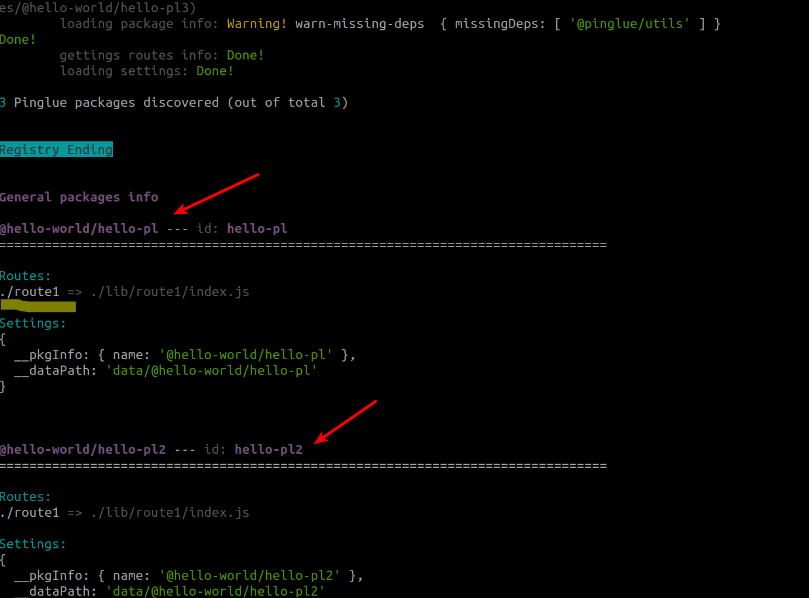
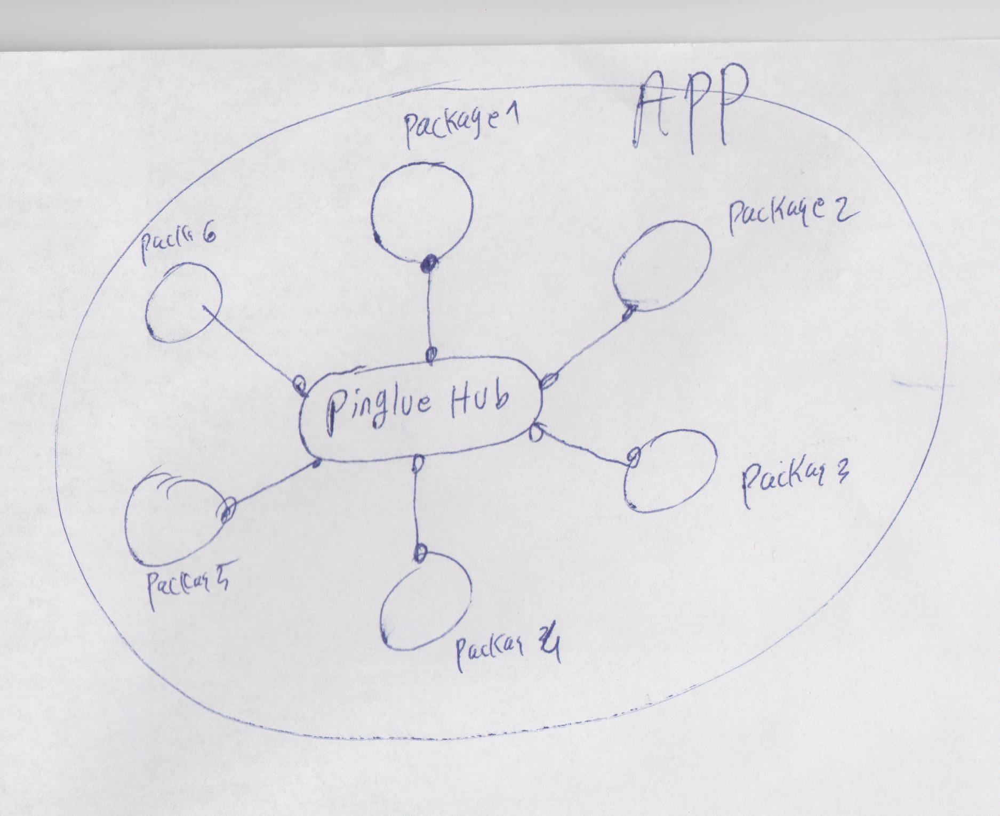

Now we have all the tools ready to use the power of Pinglue to create an app out of the three installed Pinglue plugins on our project. 

There are two ways to do that:

1. Using Pinglue CLI to bootstrap your plugins right in the terminal and run the app (no coding is needed, easiest method)

2. Programmatically, using Pinglue *HubFactory* class (requires coding, needs some technical knowledge about Pinglue classes)

To keep things simple in this tutorial, we use Pinglue CLI. But before that a little bit of background about Pinglue CLI.

Pinglue CLI setup
----------------------

Install the package *@pinglue/cli* as a dev dependency on our main project:

*From monorepo root*
```shell
npm run addto @pinglue/cli @hello-world/main -- --dev
npm run bt
```
Now you can run the Pinglue cli from the main project root using the pg bin:

*from main project folder*
```shell
npx pg
```

You should see some (hopefully colorful) instructions for the cli commands. 

As clear from these instructions, Pinglue CLI is not just for bootstrapping plugins, but for a variety of other admin and DevOp purposes. 

Checking proper plugin installation
-------------------------------------

One useful CLI command to discuss here, before we move to our goal of bootstrapping plugins, is `pg info`, which shows info about the Pinglue packages that are installed on your project. 

From the main project root:

```shell
npx pg info
```
This command should show a report listing the installed Pinglue packages. You should see the three hello-world plugins we created in previous sections:



Note that for each Pinglue package you see some essential info such as the package name, package id, the routes that they export to, etc. 

<Tip>
    The command `pg info` is very useful to validate if your plugins are created and installed successfully on your project. It can help catch some common mistakes such as forgetting to install the plugin, forgetting to add the pg.yaml file, incorrect name or format for the pg.yaml, etc. Once yo usee your plugin in the list generated by `pg info` you can be confident that your plugin is there!
</Tip>

<Tip>
    Type `npx pg help info` to learn more about the options of `pg info` command (such as how to filter the packages, etc.)
</Tip>

Bootstrapping our app using `pg run`
-------------------------------------
Now lets bootstrap the controllers we created before into an app using the Pinglue CLI:

*from project main folder*
```shell
npx pg run -s --no-print-logs route1
```

You should see the console.log massages for all three hello-world plugins we created before. 

What `pg run` does for us can be summerized as follows:

1. It creates an instance of Pinglue Hub.

2. It goes over all the installed Pinglue packages in the project (in our case, the three hello world plugins)

3. For each installed Pinglue packages, it checks whether it exports an instance of the Controller class from the given route (i.e., `route1`). If yes, it creates an instance of that controller class and adds it to the hub

4. At the end we will have a hub with all the controllers exported from the given route attached to it. We can visualized the structure with this diagram:



5. Then it inits the hub, which causes the async init method of all the controllers to run simultaneously.

6. Then it starts the hub, which causes the async start method of all the controllers to run simultaneously.


The console.log messages we saw on the screen confirm the above workflow.

<Tip>
    The above steps can also be done programmatically using the *HubFactory* class. Passing the route name and some options an instance of this class, the above mentioned steps will follow and it returns an instance of hub. Now it is up to your code to init and start the hub instance. For the sake of simplicity, this method is not discussed in this tutorial and you can refer to other tutorials for this method.  
</Tip>

Life cycle methods
---------------------

As clear from the experiment in this page, there are two life cycle methods in each controller (namely *init* and *start*) which are run by the Pinglue hub. 

Here is a brief explanation for each life cycle:

1. *init:* This method is called at the so-called *init* phase of the hub. In this phase, each controller has a chance to initialize itself. No communication is allowed between controllers at this phase. This method is an async method and init methods of all the controllers will be all run simultaneously. 

2. *start:* This method indicates that the so-called *start phase* of the hub has begun. This phase begun (or can begin) when *ALL* controllers finished their init methods. This is the last phase of the hub (and controllers) life cycle, and during this phase it is assumed that all the controllers have done their initializations and now it is safe for controllers to communicate with each other.

As clear from above explanations, the ultimate goal of this life cycle system is to avoid the situations where controller A sends a request to controller B, while the latter is still initializing and thus cannot respond back (or respond back faulty). The goal of Pinglue is to provide protocols that make it possible for various packages to work with each other.
